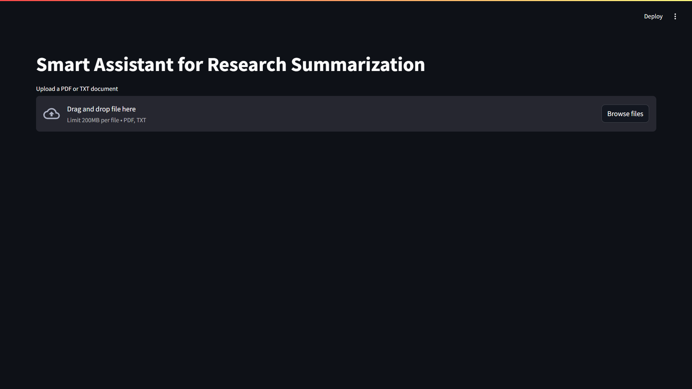

# Smart Assistant for Research Summarization

## Overview
I built this project as an AI-powered assistant that reads user-uploaded documents (PDF or TXT), summarizes them, answers questions, and generates logic-based challenges with document-grounded justifications. The assistant is designed to demonstrate contextual understanding and reasoning, going beyond basic automation.

## Features
- Upload PDF or TXT documents
- Auto-summary (≤ 150 words)
- Ask Anything: Free-form Q&A with document-based answers
- Challenge Me: Logic/comprehension questions, user answers, and feedback
- All answers justified with document references
- Clean, local web interface (Streamlit)
- Memory Handling: Supports follow-up questions by including the last 3 Q&A pairs as context for better reasoning
- Answer Highlighting: Displays the specific snippet from the source document that supports each answer or feedback, highlighted in yellow

## Setup Instructions
1. **Clone the repository**
   ```bash
    git clone https://github.com/harshkushwaha7x/Smart-Assistant-for-Research-Summarization.git
    ```
2. **Install dependencies:**
   ```bash
   pip install -r requirements.txt
   ```
3. **Set up your API key:**
   - Create a `.env` file in the project root with this line:
     ```
     GROQ_API_KEY=your_groq_api_key_here
     ```
4. **Run the app:**
   ```bash
   streamlit run app.py
   ```

## How It Works
- Upload a PDF or TXT file. The app will immediately generate and display a concise summary (≤ 150 words).
- Choose between "Ask Anything" (for free-form Q&A) or "Challenge Me" (for logic-based questions and feedback).
- All answers are grounded in the uploaded document, with justifications and highlighted supporting snippets.
- The app maintains context for follow-up questions and provides a smooth, interactive experience.

## Project Structure
```
Smart Assistant for Research Summarization/
├── app.py
├── requirements.txt
├── README.md
├── .env (not committed)
├── app_screenshot.png
└── src/
    ├── document_parser.py
    ├── summarizer.py
    └── qa_engine.py
```

## App Screenshot
